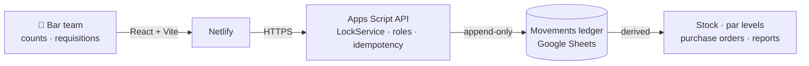

<!--
  Built like a bar menu 🍸
  · every image in /assets is generated by code (scripts/art/build.py): text is converted to vector outlines,
    so nothing external loads and it renders the same everywhere
  · "the tab" (live GitHub stats) and the snake are re-printed every night by .github/workflows/nightly.yml
-->

&nbsp;&nbsp;

### Ten years running high-end bars taught me that great service is a system. Now I build systems in code.

Software Development student @ FIAP &nbsp;·&nbsp; AI products &nbsp;·&nbsp; Full-stack &nbsp;·&nbsp; 🇧🇷 PT &nbsp;🇩🇪 DE &nbsp;🇺🇸 EN &nbsp;🇪🇸 ES &nbsp;·&nbsp; São Paulo, open to relocation

 

<b>THE MENU</b> &nbsp;—&nbsp; <a href="#aperitif">Apéritif</a> &nbsp;·&nbsp; <a href="#signature">Signature Serves</a> &nbsp;·&nbsp; <a href="#backbar">The Back Bar</a> &nbsp;·&nbsp; <a href="#method">The Method</a> &nbsp;·&nbsp; <a href="#tab">The Tab</a> &nbsp;·&nbsp; <a href="#lastcall">Last Call</a>

 

<!-- ───────────────────────────────────────────── 01 · APÉRITIF ───────────────────────────────────────────── -->

<picture>
  <source media="(prefers-color-scheme: dark)" srcset="https://raw.githubusercontent.com/francosdev/francosdev/HEAD/assets/title-aperitif-dark.svg" />
  
</picture>

Before I wrote my first line of code, I spent **a decade behind the bars of São Paulo's high-end hospitality scene**, from bartender to head bartender to head of bar. Service at that level is a system: prep, timing, inventory, people and pressure, all at once, every night.

Now I build those systems in software. I study **Systems Analysis & Development at FIAP** and ship real products with **AI, full-stack engineering and a product mindset**. The first one is already running inside a real bar.

<table>
  <tr><td>🎓&nbsp;<b>Studying</b></td><td>Systems Analysis &amp; Development · FIAP · class of 2027</td></tr>
  <tr><td>🍸&nbsp;<b>Background</b></td><td>10 years in luxury hospitality: bartender → head bartender → head of bar</td></tr>
  <tr><td>🏆&nbsp;<b>Proudest&nbsp;pour</b></td><td>Designed the cocktail menu at Lavva that won <b>Best Drinks Menu</b> at <i>Melhores da Taça 2026</i> (Prazeres da Mesa)</td></tr>
  <tr><td>🚀&nbsp;<b>Founder</b></td><td><b>Vica Experiências</b>, an events &amp; bar brand in São Paulo (since 2024)</td></tr>
  <tr><td>🗣️&nbsp;<b>Languages</b></td><td>Portuguese (native) · German (advanced) · English (upper-intermediate) · Spanish (intermediate)</td></tr>
  <tr><td>🎯&nbsp;<b>Looking&nbsp;for</b></td><td>Internships &amp; junior roles in software engineering and AI · São Paulo or relocation</td></tr>
</table>

<!-- ───────────────────────────────────────────── 02 · SIGNATURE SERVES ───────────────────────────────────────────── -->

<picture>
  <source media="(prefers-color-scheme: dark)" srcset="https://raw.githubusercontent.com/francosdev/francosdev/HEAD/assets/title-signature-dark.svg" />
  
</picture>

> **The problem:** paper checklists, late-night spreadsheet updates and stock counts nobody trusts. I lived it for years, so I built the fix.

- 📱 **Mobile-first counts** by sector (opening, closing, full), with draft recovery and a review step before anything is sent
- 🔄 **Google Sheets sync** through an Apps Script API · live stock lookup · reports and Excel / PDF / CSV exports
- 🔐 **PIN login with roles** (admin · shift leader), product and user management
- 🏭 **Running in production** at a high-volume São Paulo venue: several bars, central storage and a prep kitchen

<b>Under the hood:</b> how the production version is designed

 

The version running in production (private repo) is growing from inventory into a full operations platform:

- **Ledger, not counters.** Stock balances are never stored; they're always derived from an append-only movements table
- **Idempotent writes** keyed on natural keys, soft deletes, server-side timestamps
- **Concurrency-safe:** every write goes through Apps Script `LockService`, because a Saturday night has many hands
- **Two-step requisitions:** central stock marks *picked*, stock only moves when the bar confirms *received*, and a 24-hour auto-close is the safety valve
- **Operational day** with a 06:00 cutoff, because bar nights end after midnight

**[Repository →](https://github.com/francosdev/barops)**

 

> **The idea:** bedtime stories where *your* child is the hero, generated with AI and read together. Built first for my own kids.

- ✨ Pick emotion, theme, sidekick, setting and moral lesson → a brand-new paged story in seconds (Llama 3.3 70B via Groq)
- 📚 9 classic fairy tales retold with the child as the protagonist, plus a *memory chest* that keeps every story
- 👧👦 Siblings can share one story: the narrative calibrates to their ages
- 🛑 **Anti-engagement by design:** no streaks, no push notifications, nothing that pulls a child to use it alone. AI amplifies the parent–child moment instead of replacing it
- 🔜 Next: a Cloudflare Workers proxy (API keys off the client + rate limiting) to unlock subscriptions

**[Repository →](https://github.com/francosdev/mimo)**

 

> **The problem:** on long space missions, stress, fatigue and isolation stay invisible until they become a crisis. AURA senses them early, passively.

- 📡 Turns passive signals (sleep, comms frequency, response times, habitat use) into **ICE**, a 0–100 collective emotional index: stable · alert · critical
- 🧯 Responds in four layers: reduce stimuli → reorganize cognitive load → communication intervention → recovery
- 🤖 **AURA Sentinel**, a voice + text crew assistant: IBM Watson Assistant · Node-RED · Telegram · speech-to-text / text-to-speech · 23 intents
- 🧪 Python CLI with **69 automated tests** · Oracle relational model (13 tables) · 9-page dashboard in vanilla JS with client-side SVG charts
- 👥 Built with [Murilo Souza](https://github.com/murilo-a-souza) and [Henrique Bonachela](https://github.com/henriquebonachela) as **SolCon Tech**, FIAP Global Solution 2026 (Space Economy)

**[Live demo →](https://solcon-aura.netlify.app)** &nbsp;·&nbsp; **[Repository →](https://github.com/SolConTech/gs-aura)** &nbsp;·&nbsp; **[Pitch video →](https://youtu.be/vQAWAAlwFfM)**

 

#### 🍽️ Also on the menu

| | Project | What it is | Context |
|:-:|:--|:--|:--|
| 🌱 | **[EcoScore](https://github.com/francosdev/challenge-soulup-solcon)** · [live](https://challenge-solcon-soulup.netlify.app) | Gamified sustainability: real eco-actions earn Soul Points, achievements and a monthly ranking | FIAP Challenge 2026 × SoulUp · React + TypeScript + Tailwind |
| 🌍 | **EcoGuard** | AI urban-resilience platform on Vertex AI, Gemini and Earth Engine, demoed on Jardim Helena (São Paulo) | FIAP × Google Cloud ideathon · built in a 2.5-hour window |
| 🧠 | **MEMO** | *"Where did I leave my keys?"* Voice-driven spatial memory, mobile-first and designed for AR glasses | FIAP Future Makers · 7-person team |
| ⚔️ | **MyLog RPG** | Academic tracker with RPG mechanics, visual themes and an AI feedback "Oracle" | Side project |
| 🌿 | **Fluora** | A physical LED plant: Arduino / ESP32 and 3D-printed parts | Hardware |

<!-- ───────────────────────────────────────────── 03 · THE BACK BAR ───────────────────────────────────────────── -->

<picture>
  <source media="(prefers-color-scheme: dark)" srcset="https://raw.githubusercontent.com/francosdev/francosdev/HEAD/assets/title-backbar-dark.svg" />
  
</picture>

JavaScript · TypeScript · Python · Java · SQL · React · React Native · Expo · Vite · Tailwind CSS · HTML · CSS · Node.js · Google Apps Script · Google Cloud · LLMs &amp; AI agents · Netlify · Git · GitHub · Docker · Figma

<!-- ───────────────────────────────────────────── 04 · THE METHOD ───────────────────────────────────────────── -->

<picture>
  <source media="(prefers-color-scheme: dark)" srcset="https://raw.githubusercontent.com/francosdev/francosdev/HEAD/assets/title-method-dark.svg" />
  
</picture>

*I build the way I ran the bar: listen first, measure everything, taste before it leaves the station.*

<!-- ───────────────────────────────────────────── 05 · THE TAB & TODAY'S SPECIALS ───────────────────────────────────────────── -->

<picture>
  <source media="(prefers-color-scheme: dark)" srcset="https://raw.githubusercontent.com/francosdev/francosdev/HEAD/assets/title-tab-dark.svg" />
  
</picture>

🧾 The tab is re-printed every night by a GitHub Action with live data. <a href="scripts/tab.mjs">See how it's made →</a>

 

<picture>
  <source media="(prefers-color-scheme: dark)" srcset="https://raw.githubusercontent.com/francosdev/francosdev/output/snake-dark.svg" />
  
</picture>

<!-- ───────────────────────────────────────────── 06 · LAST CALL ───────────────────────────────────────────── -->

<picture>
  <source media="(prefers-color-scheme: dark)" srcset="https://raw.githubusercontent.com/francosdev/francosdev/HEAD/assets/title-lastcall-dark.svg" />
  
</picture>

Hiring for an internship or junior role? Or just want to talk software, AI or the perfect Negroni? **The bar is open.**

&nbsp;&nbsp;

 

This README is built like a small product: animated SVGs generated by code (<a href="scripts/art">scripts/art</a>), text converted to vectors, no third-party widgets, and a <a href=".github/workflows/nightly.yml">nightly GitHub Action</a> that prints the tab. &nbsp;<a href="#top">Back to the top ↑</a>

