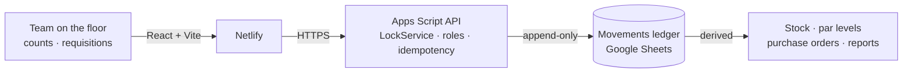

<!--
  francosdev · profile
  · every image in /assets is generated by code (scripts/art/build.py): text is converted to vector outlines,
    so nothing external loads and it renders the same everywhere
  · the telemetry panel is re-rendered every night by .github/workflows/nightly.yml (scripts/telemetry.mjs)
-->

&nbsp;&nbsp;

<a href="#profile">PROFILE</a> &nbsp;·&nbsp; <a href="#projects">PROJECTS</a> &nbsp;·&nbsp; <a href="#stack">STACK</a> &nbsp;·&nbsp; <a href="#process">PROCESS</a> &nbsp;·&nbsp; <a href="#telemetry">TELEMETRY</a> &nbsp;·&nbsp; <a href="#contact">CONTACT</a>

 

<!-- ─────────────────────────────── 01 · PROFILE ─────────────────────────────── -->

<picture>
  <source media="(prefers-color-scheme: dark)" srcset="https://raw.githubusercontent.com/francosdev/francosdev/HEAD/assets/title-profile-dark.svg" />
  
</picture>

I build products end to end, from the problem on the ground to the system running in production. I study **Systems Analysis & Development at FIAP** and focus on **AI products, full-stack engineering and software architecture**.

Before software, I spent a decade running operations in high-end hospitality. My first product came out of that world, and it's running in production today.

 

<!-- ─────────────────────────────── 02 · PROJECTS ─────────────────────────────── -->

<picture>
  <source media="(prefers-color-scheme: dark)" srcset="https://raw.githubusercontent.com/francosdev/francosdev/HEAD/assets/title-projects-dark.svg" />
  
</picture>

> Paper checklists, late-night spreadsheet updates and stock counts nobody trusts, replaced by a mobile-first system the whole team uses.

- **Mobile-first counts** by sector (opening, closing, full), with draft recovery and a review step before anything is sent
- **Google Sheets sync** through an Apps Script API · live stock lookup · reports and Excel / PDF / CSV exports
- **PIN login with roles** (admin · shift leader), product and user management
- **Running in production** across several bars, central storage and a prep kitchen

<b>Under the hood</b> · architecture of the production version

 

The version running in production (private repo) is growing from inventory into a full operations platform:

- **Ledger, not counters.** Stock balances are never stored; they're always derived from an append-only movements table
- **Idempotent writes** keyed on natural keys, soft deletes, server-side timestamps
- **Concurrency-safe:** every write goes through Apps Script `LockService`
- **Two-step requisitions:** central stock marks *picked*, stock only moves when the receiving area confirms *received*, with a 24-hour auto-close as a safety valve
- **Operational day** with a 06:00 cutoff, so after-midnight shifts land on the right date

**[Repository ↗](https://github.com/francosdev/barops)**

 

> Bedtime stories where *your* child is the hero, generated with AI and read together. Built first for my own kids.

- Pick emotion, theme, sidekick, setting and moral lesson → a brand-new paged story in seconds (Llama 3.3 70B via Groq)
- 9 classic fairy tales retold with the child as the protagonist, plus a *memory chest* that keeps every story
- Siblings can share one story: the narrative calibrates to their ages
- **Anti-engagement by design:** no streaks, no push notifications, nothing that pulls a child to use it alone. AI amplifies the parent–child moment instead of replacing it
- Next: a Cloudflare Workers proxy (API keys off the client + rate limiting) to unlock subscriptions

**[Repository ↗](https://github.com/francosdev/mimo)**

 

> On long space missions, stress, fatigue and isolation stay invisible until they become a crisis. AURA senses them early, passively.

- Turns passive signals (sleep, comms frequency, response times, habitat use) into **ICE**, a 0–100 collective emotional index: stable · alert · critical
- Responds in four layers: reduce stimuli → reorganize cognitive load → communication intervention → recovery
- **AURA Sentinel**, a voice + text crew assistant: IBM Watson Assistant · Node-RED · Telegram · speech-to-text / text-to-speech · 23 intents
- Python CLI with **69 automated tests** · Oracle relational model (13 tables) · 9-page dashboard in vanilla JS with client-side SVG charts
- Built with [Murilo Souza](https://github.com/murilo-a-souza) and [Henrique Bonachela](https://github.com/henriquebonachela) as **SolCon Tech**, FIAP Global Solution 2026 (Space Economy)

**[Live demo ↗](https://solcon-aura.netlify.app)** &nbsp;·&nbsp; **[Repository ↗](https://github.com/SolConTech/gs-aura)** &nbsp;·&nbsp; **[Pitch video ↗](https://youtu.be/vQAWAAlwFfM)**

 

#### Also shipped

| Project | What it is | Context |
|:--|:--|:--|
| **[EcoScore](https://github.com/francosdev/challenge-soulup-solcon)** · [live](https://challenge-solcon-soulup.netlify.app) | Gamified sustainability: real eco-actions earn points, achievements and a monthly ranking | FIAP Challenge 2026 × SoulUp · React + TypeScript + Tailwind |
| **EcoGuard** | AI urban-resilience platform on Vertex AI, Gemini and Earth Engine, demoed on Jardim Helena (São Paulo) | FIAP × Google Cloud ideathon · built in a 2.5-hour window |
| **MEMO** | *"Where did I leave my keys?"* Voice-driven spatial memory, mobile-first and designed for AR glasses | FIAP Future Makers · 7-person team |
| **MyLog RPG** | Academic tracker with RPG mechanics, visual themes and an AI feedback "Oracle" | Side project |
| **Fluora** | A physical LED plant: Arduino / ESP32 and 3D-printed parts | Hardware |

 

<!-- ─────────────────────────────── 03 · STACK ─────────────────────────────── -->

<picture>
  <source media="(prefers-color-scheme: dark)" srcset="https://raw.githubusercontent.com/francosdev/francosdev/HEAD/assets/title-stack-dark.svg" />
  
</picture>

JavaScript · TypeScript · Python · Java · SQL · React · React Native · Expo · Vite · Tailwind CSS · HTML · CSS · Node.js · Google Apps Script · Google Cloud · Netlify · LLMs &amp; AI agents · Git · GitHub · Docker · Figma

 

<!-- ─────────────────────────────── 04 · PROCESS ─────────────────────────────── -->

<picture>
  <source media="(prefers-color-scheme: dark)" srcset="https://raw.githubusercontent.com/francosdev/francosdev/HEAD/assets/title-process-dark.svg" />
  
</picture>

Understand the problem first. Build the smallest thing that proves it. Measure, iterate, ship.

 

<!-- ─────────────────────────────── 05 · TELEMETRY ─────────────────────────────── -->

<picture>
  <source media="(prefers-color-scheme: dark)" srcset="https://raw.githubusercontent.com/francosdev/francosdev/HEAD/assets/title-telemetry-dark.svg" />
  
</picture>

Re-rendered every night by a GitHub Action from the GitHub GraphQL API · <a href="scripts/telemetry.mjs">scripts/telemetry.mjs</a>

 

<!-- ─────────────────────────────── 06 · CONTACT ─────────────────────────────── -->

<picture>
  <source media="(prefers-color-scheme: dark)" srcset="https://raw.githubusercontent.com/francosdev/francosdev/HEAD/assets/title-contact-dark.svg" />
  
</picture>

Open to internships and junior roles in software engineering and AI. **Let's talk.**

&nbsp;&nbsp;

 

Every image here is generated by code (<a href="scripts/art">scripts/art</a>): text converted to vector outlines, no third-party widgets. &nbsp;<a href="#top">Back to top ↑</a>

